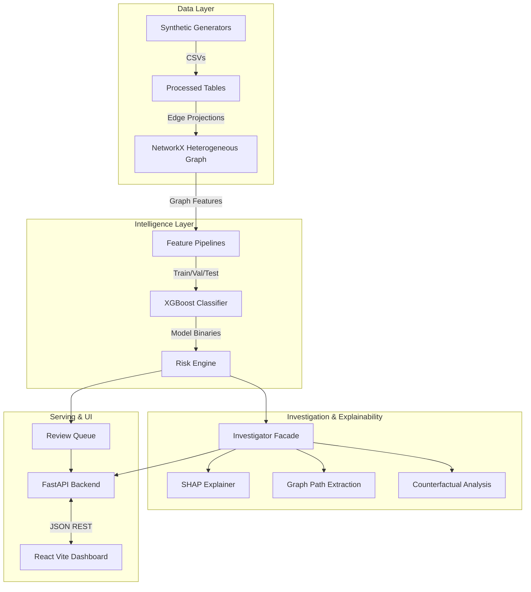

# System Architecture

AbuseRing Sentinel uses a modular architecture separating data generation, graph representation, feature engineering, machine learning, operational decision-making, and user interfaces.

## High-Level Diagram

## Layers

### 1. Data and Generation Layer
- **Generators (`src/generators/`)**: Synthesizes users, devices, IPs, addresses, payment instruments, promotions, merchants, and transactions.
- **Validation (`src/validation/`)**: Strict schema, leakage, and integrity checks ensuring the synthetic data holds structurally true.

### 2. Graph & Feature Layer
- **Graph Construction (`src/graph/`)**: Builds a unified `networkx.Graph` containing all entities and extracts user-projection graphs.
- **Feature Engineering (`src/features/`)**: Calculates transaction baselines, temporal recency features, structural graph features (centrality, two-hop reach), and Louvain communities.

### 3. Machine Learning Layer
- **Models (`src/models/`)**: Manages the training and evaluation of the models. The primary model is an XGBoost classifier leveraging both behavioral and graph structural features. 

### 4. Risk & Operational Layer
- **Risk Engine (`src/risk/engine.py`)**: Maps continuous risk scores to operational policies (e.g., Block, Review).
- **Investigator (`src/investigation/investigator.py`)**: The primary facade unifying the ML prediction, SHAP explanation, and graph traversal.

### 5. API Layer
- **FastAPI (`src/api/`)**: Provides REST endpoints for synchronous scoring, batch investigation, and fetching items from the review queue.

### 6. Frontend Presentation Layer
- **React Dashboard (`frontend/`)**: Built with Vite and TailwindCSS, providing a rapid search interface, interactive graph visualization, and explainability context.
